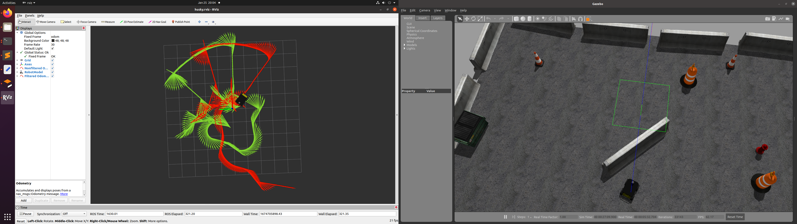

# localization-stack
This ROS Package is for robot localization. When we have more than one localizatin sensor in our robot, we can fuse them to get a better odometry data. For sensor fusion, we use extended kalman filter. To learn in-depth about this package, please read my article [how to use robot_localizaiton package](https://zillur-rahman.medium.com/how-to-use-the-ros-robot-localization-package-534fe04014d3).
To use this package, you need any two of the following ROS messages:

``` 1.nav_msgs/Odometry  2.geometry_msgs/TwistWithCovarianceStamped 3.sensor_msgs/IMU 4.geometry_msgs/PoseWithCovarianceStamped ```

We can fuse any two messages and will get a better odometry message as output.

# Implementation Details:

First, install the package using ```sudo apt install ros-$ROS_DISTRO-robot-localization```. We will use Gazebo Husky Robot Simulation. In this simulation, we will have a 4 wheel robot equipped with wheel encoder, IMU, GPS, and a LiDAR. 

To install the Husky robot, run the following commands.

```sudo apt install ros-$ROS_DISTRO-husky-simulator```

Add the following line in your bashrc file.

```export HUSKY_GAZEBO_DESCRIPTION=$(rospack find husky_gazebo)/urdf/description.gazebo.xacro```

Connect a Logitech Gamepad F710 to your computer. We will use the joystick to control the robot. Then run the following commands too:

``` 
source ~/.bashrc 
roslaunch husky_gazebo husky_playpen.launch
```
You will see gazebo simulator starts along with all required plugins. You can find all the published topics from gazebo through ```rostopic list``` and see we have IMU messages published in ```/imu/data``` topic publishing IMU messages and ```/husky_velocity_controller/odom``` topic publishing wheel encoder odometry messages from the simulation. We will fuse these two messages to get a more accurate odometry. 

Assuming you already have a catkin workspace, go to ```catkin_ws/src/``` directory. Then run the following commands to install this package.
```
git clone https://github.com/zillur-av/localization-stack.git
cd ..
catkin_make
roslaunch localization-stack ekf_localization_local.launch
```
This will start the ```robot_localization``` package and you will see two odometry messages in the rviz window. Then, move the robot using the gamepad and you see two odometry messages get updated. The red color message is the wheel encoder odometry and the green color one is the fused odometry from our package.

# Results

To understand whether our sensor fusion method works or not, move the robot. The ground/floor where the robot is moving is not perfect and as a result, you will see sometimes though the wheels are rotating, the robot is not moving. That will make a difference between two odom messages. Move the robot around and come back to the initial position. You will see the fused odom(the robot itself in rviz) gets back to initial position while the non filtered one does not.

# Acknowledgement
* http://docs.ros.org/en/noetic/api/robot_localization/html/index.html
* https://www.youtube.com/watch?v=QZ5q59H2qaI
